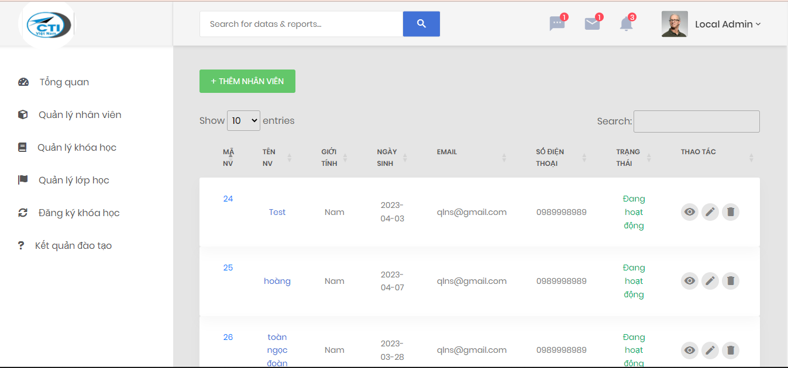

  

## Tổng quan về dự án

Hệ thống được phát triển bằng ngôn ngữ PHP để giúp quản lý thông tin nhân viên trong một tổ chức. Hệ thống này cung cấp các tính năng như thêm, sửa, xóa và tìm kiếm thông tin nhân viên, quản lý các khóa học đào tạo của tổ chức.

## Các chức năng

1. CRUD nhân viên
2. CRUD khóa học
3. CRUD lớp học
4. Phân bố lớp học
5. Kết quả đào tạo

## Hướng dẫn cài đặt

Để cài đặt ứng dụng này, bạn cần có môi trường web server như Apache và cơ sở dữ liệu MySQL. Sau khi cài đặt môi trường, bạn có thể tải mã nguồn từ Github và giải nén vào thư mục htdocs.

Các bước cụ thể như sau
1. Clone dự án từ GitHub: `git clone https://github.com/ngoctoan08/quan_ly_nhan_su.git`
2. Di chuyển vào thư mục dự án: `cd quan_ly_nhan_su`
3. Chạy ứng dụng: Truy cập http://localhost:8000/quan_ly_nhan_su

## Sử dụng

- Sau khi cài đặt, bạn có thể truy cập vào trang chủ của website tại địa chỉ http://localhost:8000/quan_ly_nhan_su
- Truy cập trang http://localhost:8000/admin/dashboard
- username: local-user@gmail.com
- password: localuser
